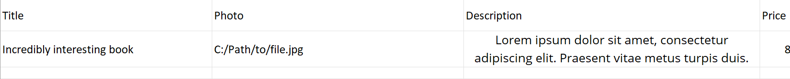
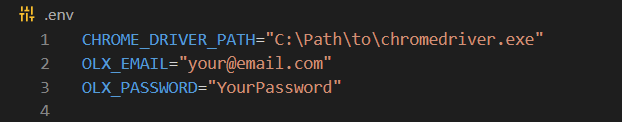

# AutomateOLX

## What is this project?
AutomateOLX is a simple automation tool, built to accelerate selling books on olx.pl

## How to start?
It is really simple! You have to:
- Make your own spreadsheet named 'OLX.xlsx', as shown below:

- Create '.env' file, which should include: 
